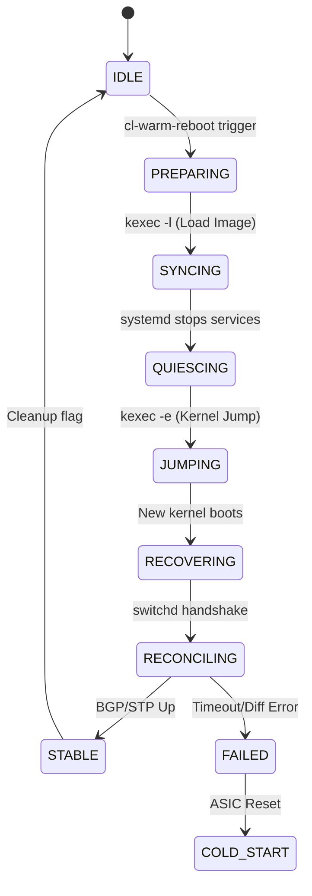

# Cumulus Linux ISSU & Warm Reboot Architecture

## 1. Overview
Cumulus Linux implements In-Service Software Upgrade (ISSU) primarily through a process called **Warm Reboot**. The goal is to reboot the Operating System (OS) and update software without interrupting the data plane (ASIC forwarding).

## 2. Why is switchd Proprietary?
`switchd` is the bridge between the open-source Linux kernel and the proprietary hardware (ASICs).
*   **Intellectual Property (IP):** It contains the "drivers" and abstraction logic for silicon from vendors like Broadcom and NVIDIA (Mellanox). These vendors consider their SDKs and hardware register maps as trade secrets.
*   **Licensing:** ASICs are sold with restrictive NDAs (Non-Disclosure Agreements). NVIDIA cannot release the code that interfaces with these SDKs because it would violate these agreements.

## 3. Can we read the Source Code?
*   **Open Components:** You can download the source for ~90% of the OS (Debian base, FRR, ifupdown2, various scripts).
*   **The "Black Box":** The specific binary `switchd` and the low-level SDKs are provided as pre-compiled objects. Even if you download the "source ISO," those parts remain binary blobs.

## 4. What Actually Changes During ISSU?
An ISSU (Warm Reboot) is typically used for a **full OS upgrade**. The following are replaced:
*   **The Linux Kernel:** A completely new kernel is loaded into memory via `kexec`.
*   **The `switchd` Binary:** The proprietary hardware manager is upgraded to a new version.
*   **Routing Daemons (FRR):** `bgpd`, `ospfd`, and `zebra` are updated.
*   **System Libraries:** Core libraries (libc, systemd, etc.) and all other Debian packages.

## 5. The User Trigger: cl-warm-reboot
The process is triggered manually using the command:
`sudo cl-warm-reboot`

This script handles the **orchestration** (flagging), **kernel loading** (kexec), and **pre-flight validation** to ensure the new `switchd` version is compatible with the current ASIC state.

## 6. Hardware & Peripheral Architecture
Cumulus follows the "Linux is the OS" philosophy, using standard drivers for hardware management.

### 6.1 Peripherals (Sensors, Fans, EEPROM)
*   **I2C & Sensors:** Managed via standard Linux **I2C** and **hwmon** kernel drivers. You can read these directly in `/sys/class/hwmon/`.
*   **Fans:** Managed by daemons like `sensord` or scripts that read temperature and write PWM values to hardware registers.
*   **EEPROM:** Device serial numbers and MAC ranges are stored in a chip accessible via `i2c-tools` or `decode-syseeprom`.

### 6.2 L2 Protocols: STP and ARP
*   **STP (Spanning Tree):** Handled by the open-source **`mstpd`** daemon. When it changes a port state, `switchd` programs that state into the ASIC hardware.
*   **ARP Management:** Uses the standard Linux kernel neighbor table. `switchd` listens to `netlink` messages and syncs these to the ASIC's high-speed **L3 Host Table**.

## 7. Key Open Source Implementations in ISSU

### 7.1 ifupdown2 (Interface Management)
Python-based tool that ensures network interfaces are not "flapped" during the reboot.
*   **Logic:** It reads the `/run/cl-warm-reboot-active` flag and skips the commands that would normally disable the physical link carrier.
*   **Source:** [GitHub/ifupdown2](https://github.com/CumulusNetworks/ifupdown2)

### 7.2 FRR - FRRouting (Routing Protocol Stack)
The most critical open-source component for ISSU.
*   **Mechanism:** Implements **Graceful Restart (GR)**. `bgpd` sends an **End-of-RIB (EoR)** marker to neighbors, who keep routes "stale" but active while FRR restarts.
*   **Source:** [GitHub/FRRouting](https://github.com/FRRouting/frr)

### 7.3 mstpd (Spanning Tree Protocol)
Serializes its Bridge Protocol Data Unit (BPDU) state to disk. Upon restart, it resumes from the saved state to prevent network loops during the upgrade.
*   **Source:** [GitHub/mstpd](https://github.com/mstpd/mstpd)

## 8. The Role of systemd in ISSU
Systemd is the state-machine orchestrator. 
*   **Targeting:** The `cl-warm-reboot` script commands systemd to start the `kexec.target`.
*   **Service Lifecycle:** systemd stops services in an order that minimizes control plane downtime.
*   **State Preservation:** Services use specialized `ExecStop` commands to serialize state before the transition.

## 9. Step-by-Step systemd Inner Workings
1.  **Preparation:** `cl-warm-reboot` creates `/run/cl-warm-reboot-active`.
2.  **Quiescing:** systemd stops `frr`. `frr` detects the flag and sends **Graceful Restart (GR)** signals to neighbors.
3.  **State Save:** systemd stops `switchd`. `switchd` calls the ASIC SDK to enter Warm Boot mode and saves its state to `/var/lib/cumulus/switchd.state`.
4.  **Transition:** systemd executes `kexec -e`. CPU jumps to the new kernel. PCIe bus is **not** reset; ASIC continues forwarding.
5.  **Recovery:** New systemd starts. New `switchd` re-attaches to the ASIC and performs reconciliation.
6.  **Completion:** New `frr` starts and re-establishes routing sessions.

## 10. Multi-Process Orchestration Patterns
ISSU is a coordinated dance between: `switchd`, `frr`, `mstpd`, `lldpd`, and `ifupdown2`.
*   **Sentinel Check:** Every service's `ExecStop` script checks for the active flag before deciding whether to save state or reset.
*   **Type=notify:** Services tell systemd when hardware reconciliation is complete so the next service (like routing) can start safely.

## 11. The ISSU State Machine


## 12. Technical Deep-Dive: Hardware-to-Software Boot Timeline

### 12.1 Hardware Storage: The SPI Flash
The **UEFI firmware** (x86) or **U-Boot** (ARM) is not "burned" into the CPU. It is stored in a dedicated **SPI Flash** chip on the motherboard. 

### 12.2 The True Boot Sequence (Cold Boot)
1.  **Power Sequencing (CPLD):** Ensures power rails are stable.
2.  **Reset Vector:** CPU starts and points to the SPI Flash.
3.  **SEC/PEI Phase:** UEFI trains the DDR RAM and performs the POST.
4.  **DXE Phase:** UEFI initializes the PCIe bus. **The Fundamental Reset signal is sent here, killing traffic.**
5.  **BDS Phase:** UEFI finds the bootloader (GRUB) on the SSD.
6.  **OS Runtime:** GRUB loads the Linux Kernel.

### 12.3 Why kexec Bypasses the Reset
`kexec` performs a **Kernel Jump**. It skips stages 1 through 5 entirely. Because the DXE/PCIe Init phase is skipped, the physical reset signal is **never sent to the ASIC**, allowing traffic to keep flowing.

### 12.4 Terminology One-Liners
*   **POST:** The firmware process that verifies hardware and sends the reset signal.
*   **UEFI:** Modern x86 firmware that performs POST and launches GRUB.
*   **U-Boot:** ARM-based bootloader that performs the same role as UEFI.
*   **Secure Boot:** Bypassed by `kexec` in many implementations.
*   **The Point of No Return:** Fallback is impossible after the jump because the old RAM state is overwritten. Reconciliation failure triggers a **Cold Start** (ASIC Reset).

## 13. The Multi-Layered Health Check Model

In Cumulus Linux, "Health Check" is not a single script; it is a **three-dimensional model** that ensures the system is safe to upgrade and stable after the reboot.

### 13.1 Layer 1: Liveness (The Watchdog)
*   **Goal:** "Is the process still running and not deadlocked?"
*   **Mechanism:** `WatchdogSec=30`.
*   **Action:** The daemon (e.g., `switchd`) must "kick" the watchdog every 15s. If it stops (even if the process still exists in the task list), systemd assumes a deadlock and restarts the service.
*   **In ISSU:** This prevents a "hung" reconciliation from blocking the system indefinitely.

### 13.2 Layer 2: Readiness (The notify Protocol / sd_notify)
*   **Goal:** "Has the process finished its work and is it ready for the next stage?"
*   **Mechanism:** `sd_notify("READY=1")`.
*   **Action:** Systemd blocks all dependent services (like BGP) until `switchd` sends this signal.
*   **Under the Hood:** 
    *   Systemd creates a **Unix Domain Socket** (`NOTIFY_SOCKET`).
    *   `switchd` sends string messages like `READY=1`, `WATCHDOG=1`, or `STATUS=Loading ASIC tables...`.
*   **In ISSU:** This is the most critical check. It ensures that routes are never pushed to the hardware until the ASIC has finished its 1-2 minute internal initialization.

### 13.3 Layer 3: Operational Health (Admin Verification)
*   **Goal:** "Is the network actually performing correctly?"
*   **Mechanism:** CLI-based verification tools.
*   **Key Tools:**
    *   `cl-resource-query`: Checks if ASIC tables (L2/L3) are near capacity.
    *   `nv show router bgp`: Verifies all BGP neighbors are `Established`.
    *   `cl-warm-reboot --check`: A pre-flight tool that aggregates these checks.
*   **Action:** If these checks fail, the administrator (or orchestration script) will abort the ISSU before the `kexec` jump.

### 13.4 Summary: What makes a "Healthy" ISSU?
| Dimension | Check Type | Success Indicator | Failure Action |
| :--- | :--- | :--- | :--- |
| **Pre-Check** | Operational | `cl-warm-reboot --check` passes | Abort Upgrade |
| **Shutdown** | Liveness | `ExecStop` completes < `TimeoutStopSec` | SIGKILL + Cold Start |
| **Startup** | Readiness | `READY=1` received < `TimeoutStartSec` | Trigger Cold Start |
| **Post-Check** | Operational | BGP sessions `Established` | Manual Rollback/Investigate |

## 14. Detailed Timeouts & systemd Parameters

Timing is critical to prevent the system from getting "wedged."

### 14.1 Start/Stop Timeouts
*   **`TimeoutStartSec`:** Set to 300s-600s for hardware daemons. This allows `switchd` enough time to read massive state files and perform reconciliation with the ASIC without systemd killing it.
*   **`TimeoutStopSec`:** Set to 120s for `frr` to ensure it can send End-of-RIB (Graceful Restart) signals to all BGP neighbors before the system jumps to the new kernel.

### 14.2 Preventing "The Wedge"
If a service hangs during the `ExecStop` phase, systemd will eventually send a `SIGKILL` after `TimeoutStopSec`.
*   **Risk:** If `switchd` is killed before it can set the **Warm Boot flag** in the ASIC registers, the next kernel will trigger a **Cold Start**, causing a total traffic drop.

## 15. Failure Modes and Prevention
*   **Stale Path Timeout:** Neighbors timeout before recovery. *Prevention: Increase BGP GR timers.*
*   **ASIC Reconciliation Failure:** New software can't map to old hardware state. *Prevention: Compatibility checks.*
*   **systemd Health Check Kills:** Watchdogs kill slow processes. *Prevention: Using `Type=notify` and extending `TimeoutStartSec`.*

## 16. Code Snippets & Unit Examples

### 16.1 Sample ISSU-Aware Unit Files
Every service that manages network "state" follows the **ExecStop Sentinel** pattern. Below are the full unit file configurations for the core ISSU-aware services.

#### A. Routing Daemon (`frr.service`)
```ini
[Unit]
Description=FRRouting
After=network-pre.target switchd.service

[Service]
Type=forking
ExecStart=/usr/lib/frr/frrinit.sh start
# During ISSU, this script sends Graceful Restart signals instead of a hard kill
ExecStop=/usr/lib/cumulus/frr-warm-reboot-check

[Install]
WantedBy=multi-user.target
```

#### B. Spanning Tree Daemon (`mstpd.service`)
```ini
[Unit]
Description=Multiple Spanning Tree Protocol Daemon
After=switchd.service

[Service]
Type=simple
ExecStart=/usr/sbin/mstpd -v
# MSTP must preserve port states (Forwarding/Blocking)
ExecStop=/usr/lib/cumulus/mstpd-warm-reboot-check

[Install]
WantedBy=multi-user.target
```

#### C. Neighbor Discovery Daemon (`lldpd.service`)
```ini
[Unit]
Description=LLDP daemon
After=network.target

[Service]
ExecStart=/usr/sbin/lldpd
# Prevents neighbor timeouts by preserving the discovery cache
ExecStop=/usr/lib/cumulus/lldpd-warm-reboot-check

[Install]
WantedBy=multi-user.target
```

### 16.2 Systemd Logic Wrapper
```bash
#!/bin/bash
if [ -f /run/cl-warm-reboot-active ]; then
    /usr/bin/switchdctl --warm-boot-prepare
else
    # Standard shutdown
fi
```

### 16.3 Proprietary Reconciliation (Pseudo-code)
```python
def restore_state():
    saved_state = load_binary_blob("/var/lib/cumulus/switchd.state")
    asic_handle = sdk.init_warm_boot()
    for route in saved_state.routes:
        if not asic_handle.verify_route(route):
            asic_handle.program_route(route)
    asic_handle.warm_boot_complete()
```

## 17. Appendix: Understanding systemd Unit Files
*   **[Unit]:** Metadata and dependencies (`After=`, `Requires=`). Defines the system graph.
*   **[Service]:** Execution logic. Includes `ExecStart`, `ExecStop` (ISSU state save), and `Type=notify`.
*   **[Install]:** Defines how the service is enabled (typically `WantedBy=multi-user.target`).

## 18. Watchdog Architecture: Hardware vs. Software
*   **Application Layer:** A dedicated thread in `switchd` sends heartbeats to systemd.
*   **Kernel Layer:** The kernel driver (e.g., `iTCO_wdt`) manages the physical `/dev/watchdog` device.
*   **Hardware Layer:** A physical chip pulls the **CPU Reset Pin** if not petted.
*   **ISSU Handling:** The watchdog is **disarmed** immediately before the `kexec` jump to prevent a hardware reboot during the transition.

## 19. IPC & Process Coordination
Processes like `switchd` and `frr` **do not talk directly.** 
*   **Kernel as Broker:** They use the **Netlink protocol** to sync via the Linux Kernel RIB.
*   **Zebra Protocol:** FRR internal daemons (`bgpd`, `ospfd`) talk to `zebra` via Unix Domain Sockets.
*   **Sentinel Flag:** The filesystem file `/run/cl-warm-reboot-active` is the global ISSU signal.

## 20. Versioning & Compatibility
*   **Image Versioning:** Major.minor.patch scheme.
*   **State Version:** `switchd` verifies its binary can read the saved state file.
*   **ASIC Migration:** ISSU is **generation-locked**. Moving from Tomahawk 1 to Tomahawk 2 requires a Cold Boot.

## 20. Version Upgrade Matrix & Compatibility Logic

To ensure a "hitless" upgrade, the system must guarantee that the new version of `switchd` can understand the data left behind by the old version.

### 20.1 State Versioning Mechanism
Every version of the proprietary `switchd` binary is compiled with a **State Version ID**. 
*   **Serialization:** When the old `switchd` stops, it writes its internal state (routes, VLANs, ACLs) to `/var/lib/cumulus/switchd.state`. This file starts with a header containing the State Version ID.
*   **Validation:** When the new `switchd` starts, it reads this header. If the ID is too old (or too new), it will refuse to reconcile and trigger a **Cold Start** to protect the hardware.

### 20.2 The "n+1" Support Rule
Cumulus Linux generally follows a strict upgrade matrix for Warm Reboot:
*   **Supported:** Upgrading to the **next minor version** (e.g., 5.3.0 -> 5.4.0) or any **patch version** (e.g., 5.3.0 -> 5.3.2).
*   **Restricted:** Skipping one minor version (e.g., 5.1 -> 5.3) is often supported, but check the release notes.
*   **Unsupported:** Skipping two or more minor versions (e.g., 4.4 -> 5.4) or major version jumps typically require a **Cold Reboot** because the state serialization format has changed too significantly.

### 20.3 Conceptual Upgrade Matrix
| Source Version | Target Version | Upgrade Type | ISSU Possible? |
| :--- | :--- | :--- | :--- |
| 5.3.x | 5.3.y | Patch | **YES** (Always) |
| 5.3.x | 5.4.0 | Next Minor | **YES** |
| 5.2.x | 5.4.0 | Skip Minor | **MAYBE** (Check Notes) |
| 4.x.x | 5.x.x | Major | **NO** (Cold Boot) |

### 20.4 How it's Handled (The Pre-flight Check)
The `cl-warm-reboot` script doesn't just "hope" it works. It performs a **Compatibility Handshake**:
1.  **Extract:** It extracts the `switchd` binary from the *new* OS image while still running the *old* OS.
2.  **Dry Run:** It runs the new `switchd` in a special `--check-compat` mode.
3.  **Handshake:** The new binary looks at the running system's state format.
4.  **Verdict:** If the new binary says "I can't read this," the `cl-warm-reboot` script aborts the process **before** anything is stopped, saving the user from a failed upgrade.

## 21. Further Reading
*   **systemd Manuals:** [systemd.unit(5)](https://www.freedesktop.org/software/systemd/man/systemd.unit.html).
*   **NVIDIA Guides:** [Upgrading Cumulus Linux](https://docs.nvidia.com/networking-ethernet-software/cumulus-linux-59/System-Management/Upgrading-Cumulus-Linux/).
*   **SONiC Open Source Architecture:** [SONiC Warm Reboot](https://github.com/sonic-net/SONiC/blob/master/doc/warm-reboot/SONiC_Warm_Reboot_Design.md).
